# SIT ACM Portal

Production-grade web platform for ACM chapter operations, event management, and member engagement.

> Source code is private. This repository documents architecture, engineering decisions, and implementation details.

## Problem

Student chapters require a unified, reliable platform to manage events, memberships, alumni, certificates, and communications. Manual processes cause inefficiency, fragmented data, and poor user experience for all stakeholders.

## Solution

SIT ACM Portal centralizes all chapter operations. The system provides:

- Authenticated admin workflows for content and user management
- Public event, alumni, and certificate access for students and alumni
- Real-time data updates and secure media handling

Admins manage events, members, blogs, and certificates via a secure dashboard. Students and alumni interact with events, directories, and verification tools. All data is persisted in Firestore and media is handled by Cloudinary.

## System Capabilities

- Centralized event management with real-time updates
- Certificate issuance and public verification
- Structured member and alumni directories
- Role-based admin authentication and session management
- Blog publishing and content management
- Media gallery with Cloudinary-backed uploads

## Key Features

- **Event Management:** Create, edit, and list events. Internally, Firestore stores event documents; UI updates in real time via listeners.
- **Certificate Verification:** Issue and verify certificates. Verification queries Firestore by certId and returns results instantly.
- **Member/Alumni Directory:** List and search members/alumni. Data is fetched from Firestore collections and rendered with dynamic routing.
- **Role-based Route Protection:** Admin routes are gated by Firebase Auth and role checks; unauthorized users are redirected.
- **Blog System:** Publish and manage articles. Blogs are stored in Firestore and rendered with markdown support.
- **Gallery:** Upload and display event photos. Images are uploaded to Cloudinary, metadata stored in Firestore.

## Engineering Decisions

**Firebase:** Selected for real-time updates, flexible NoSQL schema, and integrated authentication. Eliminates backend maintenance and scales for student organization needs.

**Next.js App Router:** Enables hybrid SSR/CSR, modular routing, and maintainable codebase. App Router structure supports feature isolation and rapid UI iteration.

**Cloudinary:** Offloads media storage and transformation, reducing backend complexity. Enables fast, reliable image delivery and CDN-backed optimization.

## Real Code Snippets

```ts
// Fetch and map event data
const snapshot = await getDocs(collection(db, "events"));
const events = snapshot.docs.map(doc => ({
	id: doc.id,
	...doc.data(),
}));
```
*Fetches all events from Firestore and maps each document to an event object with its ID. This approach ensures unique keys for React lists and efficient data access.*

```ts
// Role-based route protection (admin gate)
if (!user || user.role !== "admin") {
	redirect("/admin/login");
	return null;
}
```
*Protects admin routes by checking authentication and role. Unauthorized users are redirected before sensitive UI renders.*

```ts
// Certificate verification logic
const snapshot = await getDocs(query(collection(db, "certificates"), where("certId", "==", certId)));
const cert = snapshot.docs[0]?.data() ?? null;
```
*Looks up a certificate by ID for public verification. Uses a Firestore query for efficient lookup and null-safe handling.*

```ts
// Data mapping for alumni list
const snapshot = await getDocs(collection(db, "alumni"));
const alumni = snapshot.docs.map(doc => ({
	id: doc.id,
	...doc.data(),
}));
```
*Fetches all alumni records and maps them for directory display. Ensures each profile is accessible by unique ID.*

## Screenshots

### Homepage / Cover

Entry point of the system. Presents chapter branding, highlights, and navigation to all major modules. First impression for all users.

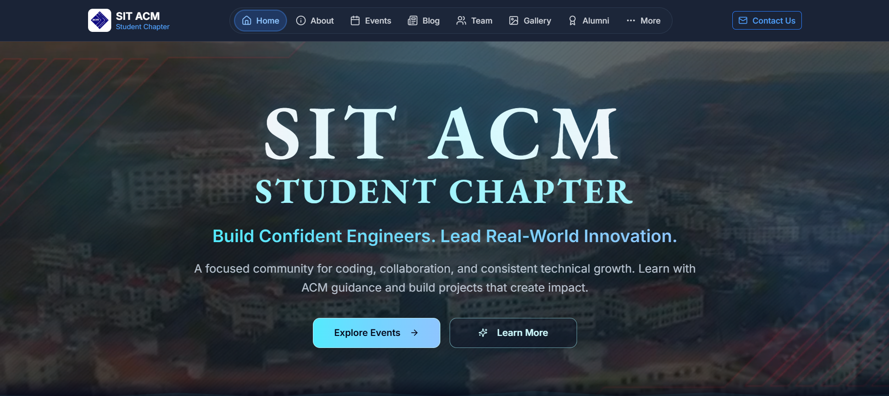

### Events Page

Lists all upcoming and past events. On load, the frontend queries Firestore for event data and renders event cards. Clicking an event uses dynamic routing to fetch and display event details by slug.

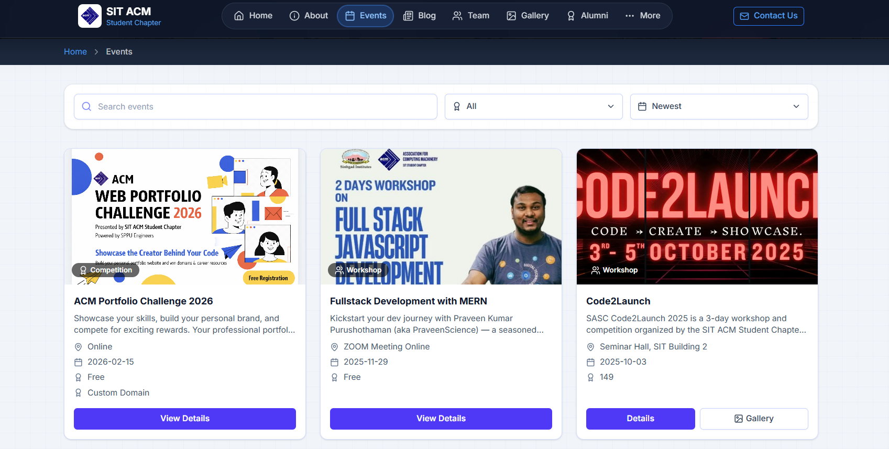

### Event Calendar

Displays a timeline/calendar of events. UI visualizes event dates and supports navigation to event details. Timeline logic maps Firestore event data to calendar components.


### Admin Dashboard

Accessible only to authenticated admins. Provides CRUD operations for events, blogs, members, and certificates. Role-based access enforced at both UI and API levels.

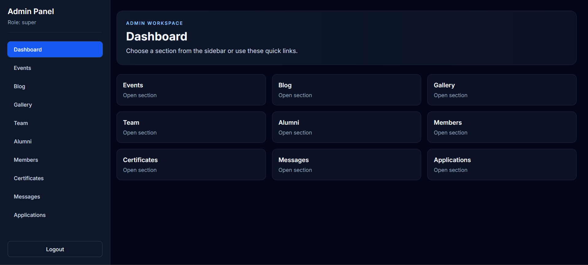

### Certificate Verification

Public users enter a certificate ID. The system queries Firestore for a matching record and displays verification status and details if found. Handles invalid or missing IDs gracefully.

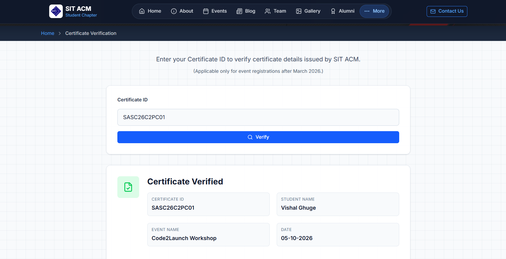

### Alumni List + Profile

Directory of alumni with search and filter. Clicking a profile uses dynamic routing to fetch and display detailed alumni info.

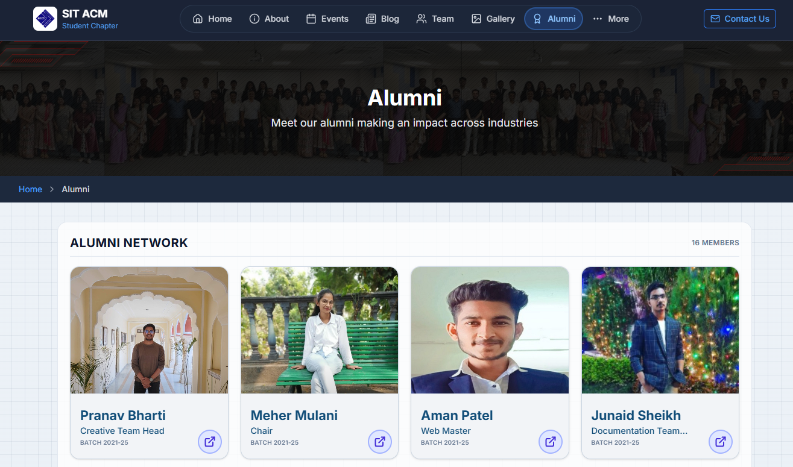
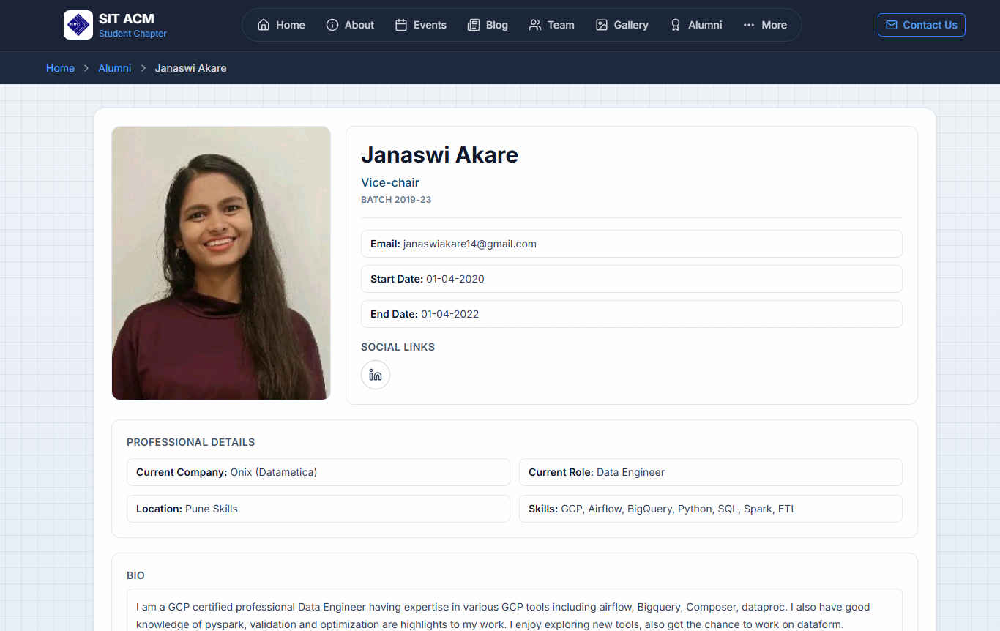

### Blog System

Admins publish articles; users read blogs. Content is stored in Firestore and rendered with markdown support. Dynamic routing enables detail views.

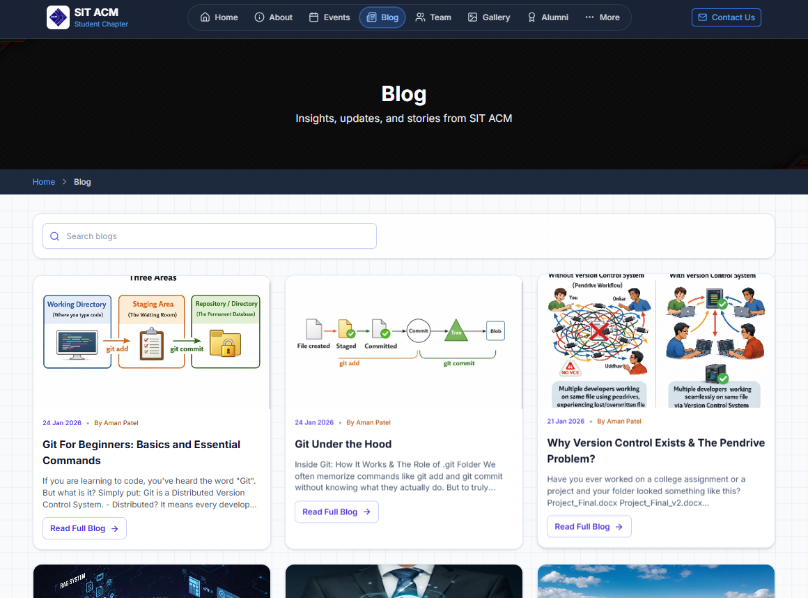

### Gallery

Event and chapter photos are uploaded to Cloudinary and displayed in a gallery UI. Media handling is offloaded from the backend, ensuring fast load times and CDN delivery.

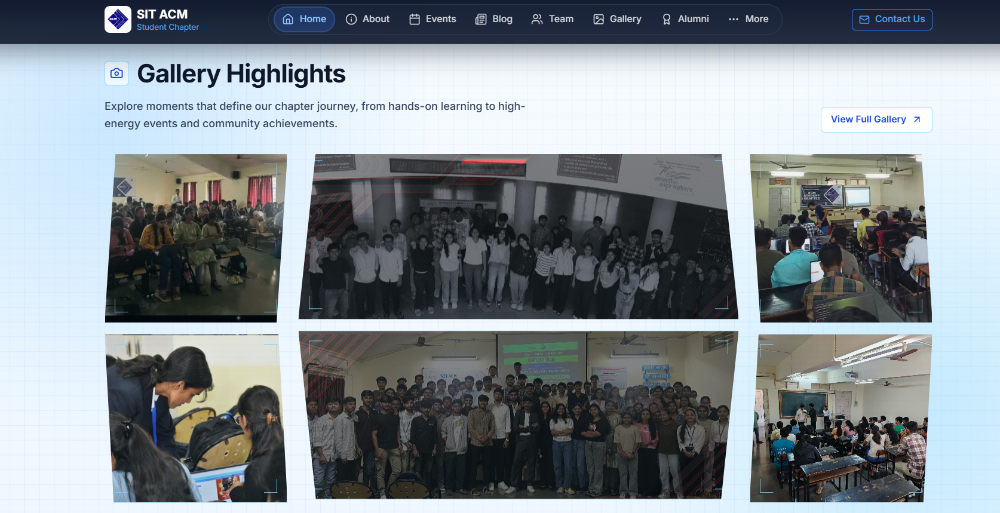

### Team Section

Displays chapter team by year. Data is fetched from Firestore and rendered with year-based filtering and dynamic routing.

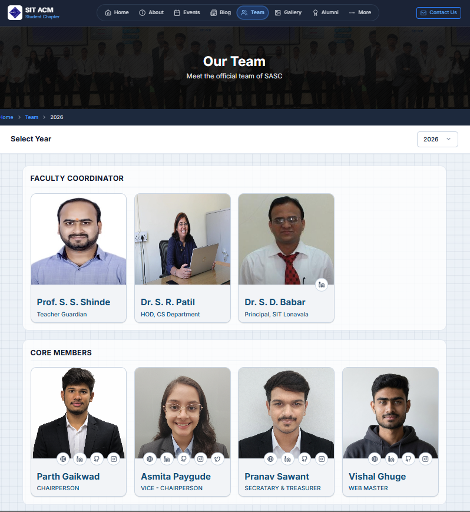

### Recruitment Form

Form for new member applications. Submissions are validated and written to Firestore. UI provides feedback on submission status.

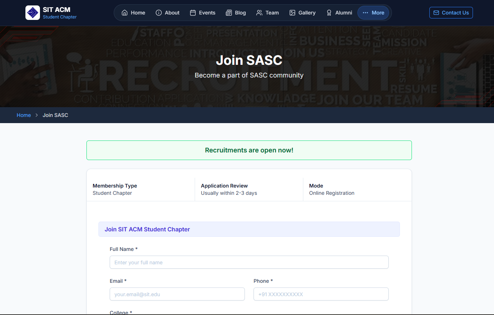

### Member ID

Displays digital member ID cards. IDs are generated and rendered for authenticated members, supporting verification and chapter access.

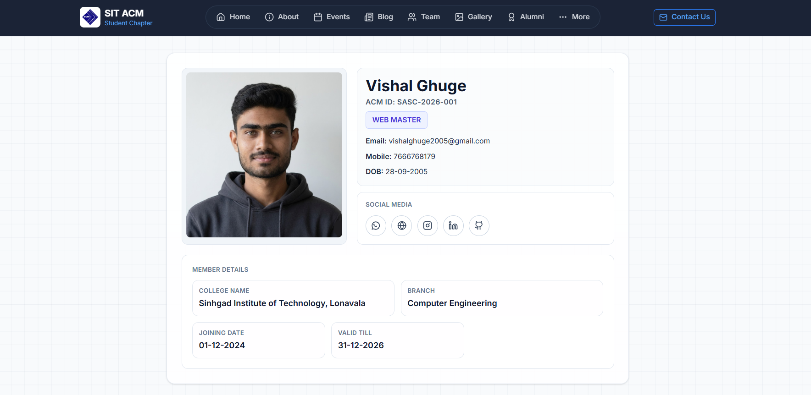

---

See [./docs/architecture.md](./docs/architecture.md) for system structure, [./docs/modules.md](./docs/modules.md) for module breakdown, and [./docs/data-flow.md](./docs/data-flow.md) for process flows.
